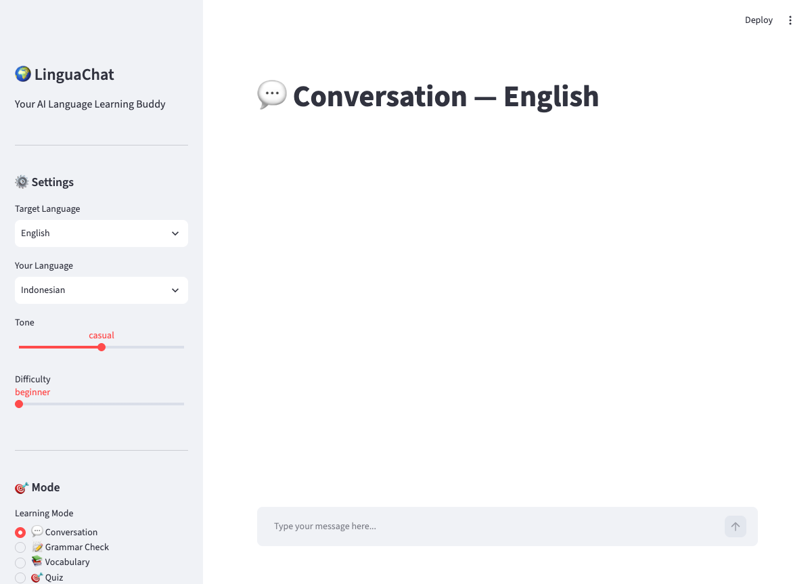

# 🌍 LinguaChat

> **AI Language Learning Buddy** — Practice any language with an AI tutor that
> corrects your grammar, builds your vocabulary, and quizzes you — all for
> **free** using Google Gemini API.



---

## Features

| Feature | Description |
|---|---|
| 💬 **Conversation** | Chat naturally in your target language. AI gently corrects mistakes. |
| 📝 **Grammar Check** | Write a sentence and get detailed grammar corrections with rule explanations. |
| 📚 **Vocabulary** | Ask about any word — definition, example sentences, synonyms, usage notes. |
| 🎯 **Quiz** | AI-generated quizzes (translate, fill-in-blank, multiple choice). |
| ⚙️ **Configurable** | Target language, native language, tone, difficulty — all adjustable. |
| 🧠 **Memory** | Remembers last 10 exchanges for context-aware conversations. |

### Supported Languages

| Target Languages | Interface Languages |
|---|---|
| English, Japanese, Korean, Mandarin, French, Spanish | Indonesian, English, Japanese, Korean |

### Tone & Difficulty

| Tone | Difficulty |
|---|---|
| 🎯 Formal — structured, academic | 🟢 Beginner — basic vocabulary & grammar |
| 😊 Casual — relaxed, everyday speech | 🟡 Intermediate — more complex sentences |
| 🤝 Friendly — warm, encouraging | 🔴 Advanced — nuanced, idiomatic |

---

## Quick Start

### Prerequisites

- Python 3.10+
- [Google Gemini API Key](https://aistudio.google.com/apikey) (free — no credit card required)

### Local Setup

```bash
# 1. Clone and enter the project
cd lingua-chat

# 2. Create virtual environment
python -m venv .venv
source .venv/bin/activate  # Windows: .venv\Scripts\activate

# 3. Install dependencies
pip install -r requirements.txt

# 4. Configure API key
cp .env.example .env
# Edit .env and add your Gemini API key:
#   GEMINI_API_KEY=your-key-here

# 5. Run
streamlit run app.py
```

Open **http://localhost:8501** in your browser.

### Docker

```bash
# Build and run
docker compose up -d
# → http://localhost:8501

# Rebuild after code changes
docker compose up --build -d

# View logs
docker compose logs -f

# Stop
docker compose down
```

Environment variables are loaded from `.env`. You can also override the
port:

```bash
PORT=8080 docker compose up -d
```

---

## Configuration

### Environment Variables

| Variable | Required | Default | Description |
|---|---|---|---|
| `GEMINI_API_KEY` | ✅ | — | Your Google Gemini API key |
| `PORT` | ❌ | `8501` | Host port for Docker |

### Application Settings (Sidebar)

All settings are adjustable from the sidebar UI:

| Setting | Options | Description |
|---|---|---|
| Target Language | English, Japanese, Korean, Mandarin, French, Spanish | Language you're learning |
| Your Language | Indonesian, English, Japanese, Korean | Your native language |
| Tone | Formal, Casual, Friendly | AI response style |
| Difficulty | Beginner, Intermediate, Advanced | Vocabulary & grammar level |
| Mode | Conversation, Grammar, Vocabulary, Quiz | Learning activity |

### Default Configuration (`config.py`)

```python
DEFAULT_CONFIG = {
    "target_language": "English",
    "native_language": "Indonesian",
    "tone": "casual",
    "difficulty": "beginner",
    "focus_mode": "conversation",
    "memory_enabled": True,
    "max_history": 10,
}
```

---

## Architecture

```
┌─────────────────────────────────────────────────────┐
│                    Streamlit UI                      │
│  (app.py)                                            │
│  ┌──────────┐  ┌──────────────────────────────────┐ │
│  │  Sidebar  │  │         Chat Area                │ │
│  │  Settings │  │  ┌─────┐ ┌─────┐ ┌─────┐       │ │
│  │  Modes   │  │  │User │ │ AI  │ │User │ ...   │ │
│  │  Clear   │  │  └─────┘ └─────┘ └─────┘       │ │
│  └──────────┘  └──────────────────────────────────┘ │
└──────────────────────┬──────────────────────────────┘
                       │
┌──────────────────────▼──────────────────────────────┐
│              Chat Engine (chat_engine.py)             │
│  ┌─────────────────────────────────────────────────┐ │
│  │  build_system_prompt() → mode-specific prompt   │ │
│  │  get_ai_response()    → Gemini API call         │ │
│  │                    │                           │ │
│  └────────────────────┼───────────────────────────┘ │
└───────────────────────┼─────────────────────────────┘
                        │
┌───────────────────────▼─────────────────────────────┐
│         Google Gemini API (gemini-3.5-flash)          │
│              Free Tier: 15 req/min                   │
└─────────────────────────────────────────────────────┘
```

### File Structure

```
lingua-chat/
├── app.py                 # Streamlit UI — sidebar + chat
├── chat_engine.py         # Gemini API integration + prompt builder
├── config.py              # Default settings & constants
├── requirements.txt       # Python dependencies
├── Dockerfile             # Production container image
├── docker-compose.yml     # Orchestrated deployment
├── .env.example           # Environment variable template
├── .gitignore
├── screenshots/           # App previews
└── README.md              # This file
```

---

## API Reference

### `chat_engine.build_system_prompt(config: dict) -> str`

Constructs a prompt that instructs Gemini how to behave based on the
selected mode, language, tone, and difficulty.

**Parameters:**

| Parameter | Type | Description |
|---|---|---|
| `config["focus_mode"]` | `str` | `conversation`, `grammar`, `vocab`, or `quiz` |
| `config["target_language"]` | `str` | e.g. `"English"`, `"Japanese"` |
| `config["native_language"]` | `str` | e.g. `"Indonesian"` |
| `config["tone"]` | `str` | `"formal"`, `"casual"`, `"friendly"` |
| `config["difficulty"]` | `str` | `"beginner"`, `"intermediate"`, `"advanced"` |

### `chat_engine.get_ai_response(config, messages, user_input) -> str`

Sends the conversation history + new input to Gemini and returns the
AI response text.

**Parameters:**

| Parameter | Type | Description |
|---|---|---|
| `config` | `dict` | Application configuration |
| `messages` | `list[dict]` | Chat history `[{"role": "user"/"assistant", "content": "..."}]` |
| `user_input` | `str` | Latest user message |

---

## Deployment

### Docker (Recommended for Production)

```bash
# Build image
docker build -t lingua-chat .

# Run container
docker run -d \
  --name lingua-chat \
  -p 8501:8501 \
  --env-file .env \
  --restart unless-stopped \
  --memory 512m \
  lingua-chat
```

### Docker Compose

```bash
docker compose up -d
```

---

## Running Without Docker

Run LinguaChat directly on any system with Python — no container runtime
required.

### 1. Prerequisites

- **Python 3.10+** — check with `python3 --version`
- **pip** — Python package manager
- **Git** — to clone the repository

### 2. Clone & Enter

```bash
git clone <repository-url> lingua-chat
cd lingua-chat
```

### 3. Create Virtual Environment (Recommended)

Isolates dependencies from your system Python:

```bash
# macOS / Linux
python3 -m venv .venv
source .venv/bin/activate

# Windows
python -m venv .venv
.venv\Scripts\activate
```

You should see `(.venv)` in your terminal prompt.

### 4. Install Dependencies

```bash
pip install -r requirements.txt
```

### 5. Configure API Key

```bash
cp .env.example .env
```

Edit `.env` and add your Gemini API key:

```
GEMINI_API_KEY=AIzaSy...
```

> Get a free key at https://aistudio.google.com/apikey — no credit card required.

### 6. Run the App

```bash
streamlit run app.py
```

Open **http://localhost:8501** in your browser.

### Development Mode (Hot Reload)

Automatically reloads the app when you edit Python files:

```bash
streamlit run app.py --server.runOnSave true
```

### Using a Different Port

```bash
streamlit run app.py --server.port 8080
```

### Stop the App

Press `Ctrl + C` in the terminal where Streamlit is running, or close the terminal.

---

### Cloud Deployment

The app is a standard Streamlit application and can be deployed to any
container platform:

- **Google Cloud Run** — push the Docker image to Artifact Registry
- **AWS ECS / Fargate** — use the Dockerfile as-is
- **Azure Container Apps** — configure with `--server.headless=true`
- **Streamlit Community Cloud** — connect your GitHub repo, set
  `GEMINI_API_KEY` as a secret

### Health Check

The container exposes a health endpoint at `/_stcore/health` (Streamlit
built-in). Docker Compose is configured with a 30s health check interval.

---

## Development

```bash
# Create venv
python -m venv .venv && source .venv/bin/activate

# Install dev dependencies
pip install -r requirements.txt

# Run locally with hot reload
streamlit run app.py --server.runOnSave true
```

### Adding a New Language

Edit `config.py`:

```python
LANGUAGES = ["English", "Japanese", "Korean", "Mandarin", "French", "Spanish", "German"]
```

### Adding a New Mode

1. Add the key to `MODES` and entries to `MODE_LABELS` / `MODE_DESCRIPTIONS` in `config.py`.
2. Add a mode instruction block in `chat_engine.py` `build_system_prompt()`.
3. The UI renders automatically.

---

## Tech Stack

| Component | Technology | Cost |
|---|---|---|
| Frontend / UI | **Streamlit** | Free (open source) |
| AI Engine | **Google Gemini 3.5 Flash** | Free (15 req/min, 1500 req/day) |
| Runtime | **Python 3.11+** | Free |
| Deployment | **Docker** | Optional |

---

## License

MIT © 2026 Subchan Yayan Bachtiar

---

*Built with ❤️ using [Streamlit](https://streamlit.io) and [Google Gemini API](https://ai.google.dev/).*
